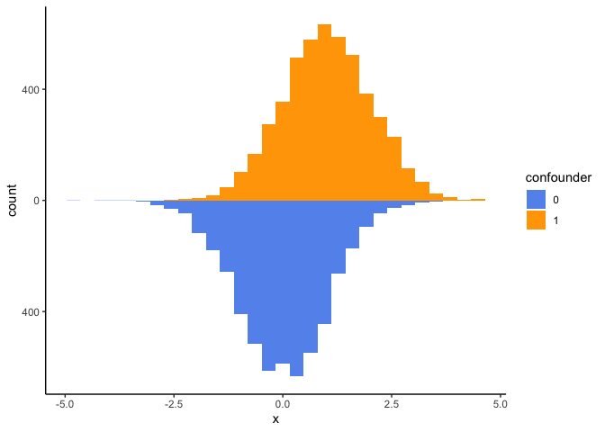
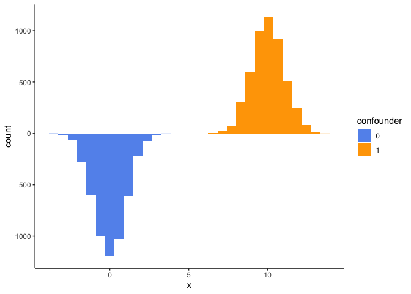
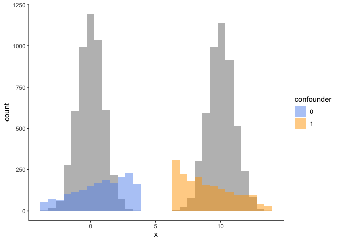
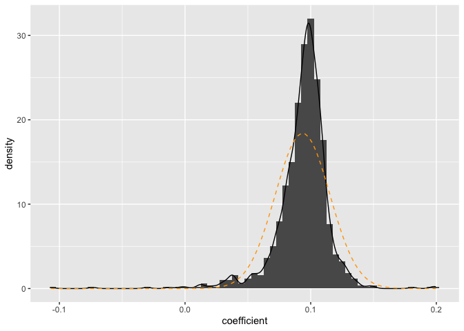
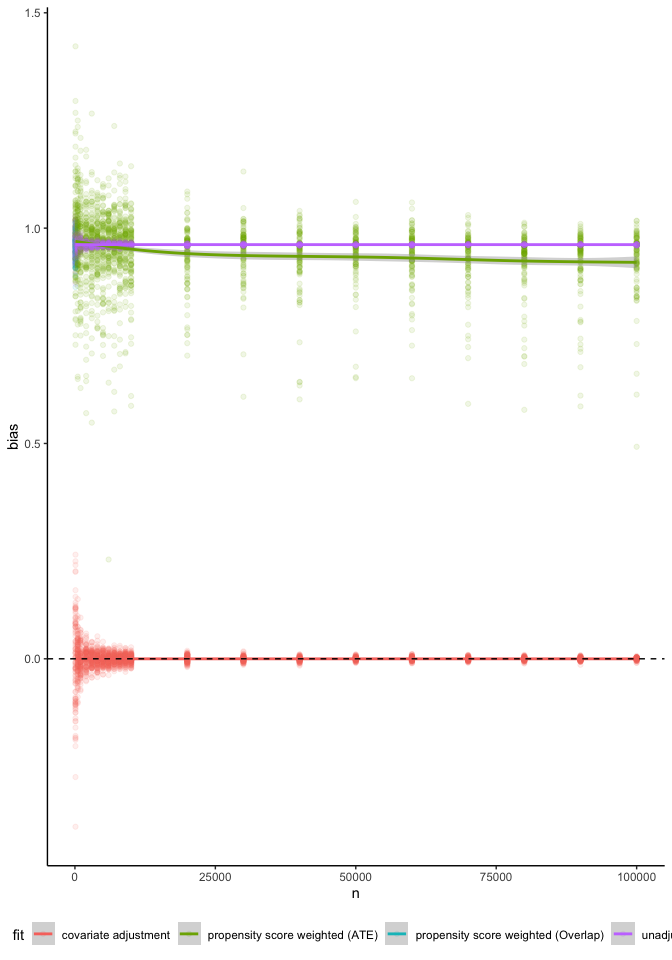
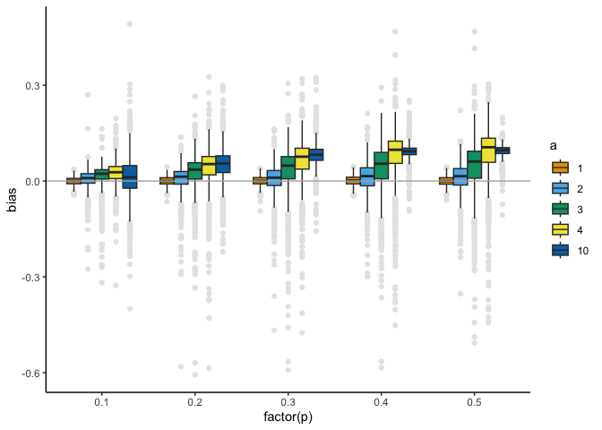
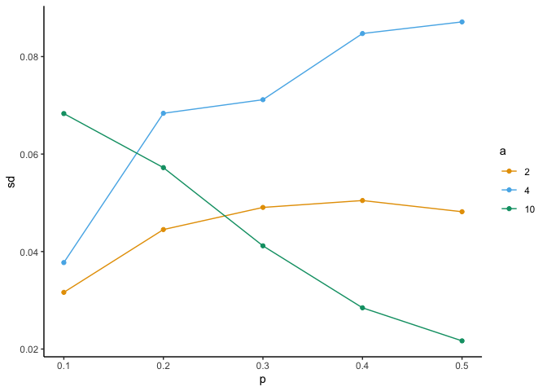

The bad news about non-structural lack of positivity for continuous
exposures
================

## Introduction

The formal goal of much research is to investigate and quantify causal
relationships between variables of interest. Methods for drawing causal
inference from data have seen widespread development and popularity over
the last few decades (Imbens and Rubin 2015 ; Morgan and Winship 2015 ;
Glymour, Pearl, and Jewell 2016 ; Hernán and Robins 2020). However, the
majority of causal methods are defined for settings with discrete-valued
(typically binary) exposures. Despite the high prevalence of
continuous-valued exposures in scientific research, existing methods for
continuous exposures are underdeveloped and understudied compared to
their discrete counterparts.

The discrete vs. continuous nature of an exposure of interest can
require modest modifications to some methods, but fairly large
modifications to others. For an example of the former, consider outcome
model-based approaches, such as g-computation (J. Robins 1986 ; Snowden,
Rose, and Mortimer 2011). G-computation entails fitting a model for the
outcome conditional on exposure and confounders, and marginalizing over
the confounder variables. This process is agnostic to whether the
exposure is discrete or continuous, although in practice the outcome
model may be much harder to specify correctly when the exposure is
continuous. For an example of the latter, consider propensity
score-based approaches, such as inverse-probability weighting (IPW) (J.
M. Robins, Hernán, and Brumback 2000 ; Cole and Hernán 2008). IPW
methods entail fitting a model for the exposure conditional on
confounders and weighting subjects according to their \`\`propensity’’
to receive their exposure value. This propensity is typically defined as
a probability for discrete exposure and a density for continuous
exposures (Naimi et al. 2014), introducing fairly large changes to the
method in both its theoretical justification and its usage in practice.
Understanding the conditions under which each of these commonly used
approaches is more suitable for an analysis is key to informing
statistical practice. However, the finite-sample properties of causal
methods for continuous exposures are under-explored, particularly in
settings where their underlying assumptions may be violated.

The assumptions for drawing causal inference from data are related to
the *assignment mechanism*. There are three key assumptions: (1) the
assignment is *individualistic*, that is, an individual’s assignment
probability cannot depend on the values of covariates or potential
outcomes of other individuals; (2) the assignment is *unconfounded*,
i.e., the assignment mechanism cannot depend on the potential outcomes;
and (3) the assignment is *probabilistic*, such that there is a non-zero
probability for each treatment value for every individual. (Imbens and
Rubin 2015) This final assumption, sometimes referred to as
*positivity*, has been shown to be a sensitivity point for methods in
the discrete exposure setting, even when the assumption is known to hold
but the number of individuals for certain exposure-covariate
combinations is small (**peterson2012diagnosing?** ; Léger et al. 2022).
This paper explores how sensitive popular causal methods are to similar
non-structural positivity violations in the continuous exposure setting.

The structure of this paper is as follows. In Section 2, we define
notation and both standard and generalized propensity scores. In Section
3, we define the primary methods of interest for comparison. In Section
4, these methods are compared under a variety of data generating
mechanisms corresponding to varying strengths of non-structural
positivity violations. Section 5 concludes with discussion and
recommendations for practitioners.

## Notation and propensity scores

Denote the continuous exposure as $T$, which takes on values in a set
$\mathscr{T}$. For individual $i$ and each value of the exposure, $t$,
there is a potential outcome $Y_i(t)$. (Imbens 2000) Each individual
also has a vector of pre-exposure covariates, $X_i$. In the most general
case, the assignment mechanism is defined as
$P(T=t|\mathbf{X}, \mathbf{Y}(t))$ (with the unconfounded assumption
this reduced to $P(T=t|\mathbf{X})$. An assignment mechanism is
*probabilisitic* if the probability of assignment to each exposure level
is strictly between 0 and 1:

$$0 < P_i(X, Y(t)) < 1, \textrm{ for each possible } X, Y(t)$$

for all $i=1, \dots, N$ In other words, the probabilistic (positivity)
assumption states that for all individuals within strata of $X$ there
exists a non-zero probability of receiving every exposure level.

## GPS

A generalized propensity score is defined as:

$$e(t, x) = P(T = t | X = x)$$ Often, for continuous exposures this is
estimated by first fitting a linear regression model prediction the
exposure from a set of pre-exposure covariates. We then use the fitted
values and the model variance in a Gaussian probability density
function. (Austin 2019)

$$e(t, x) = f_{T|X}(t|x) = \frac{1}{\sqrt{2\pi\hat\sigma^2}}\exp\left\{-\frac{(t-X\hat\beta)^2}{2\pi\hat\sigma^2}\right\}$$
The following stabilized weight is then used, where the numerator is the
marginal density of the exposure.

$$w = \frac{f_T(t)}{f_{T|X}(t|x)} = \frac{\hat{\sigma}_{t|x}}{\hat\sigma_t}\exp\left\{\frac{(t-X\hat\beta)^2}{2\hat\sigma_{t|x}^2}-\frac{(t-\mu_t)^2}{2\hat\sigma_t^2}\right\}$$
\## Positivity

Violations (or near violations) of the probabilistic assumption can
increase both the bias and variance of causal effect estimates.
(Petersen et al. 2012). There are two ways this violation can arise:
structural non-positivity and random non-positivity. The former suggests
that there is a structural mechanism that makes certain levels of the
exposure impossible for a subset of individuals. The latter are random
violations that can occur in finite samples due to chance. This paper
will focus on random violations of positivity, demonstrating that
“finite” does not mean small, but rather in the case of continuous
exposures can be any sample size that is not infinite.

## Simulations

We examine 3 scenarios:

1.  A single binary confounder with a moderate effect on the exposure
    and outcome
2.  A single binary confounder with a large effect on the exposure and
    moderate effect on the outcome
3.  A single binary confounder with a large effect on the exposure and
    large effect on the outcome.

We generate a binary confounder, $X$, from a Bernoulli distribution with
probability 0.5. The continuous exposure, $T$ is generated as follows:

$$
T = aX + \varepsilon_{t|x}
 \qquad(1)$$ Where $\varepsilon_{t|x}\sim N(0,1)$ and $Y$ such
that the “true” effect of $T$ is 0:

$$
Y = bX + \varepsilon_{y|x}
 \qquad(2)$$

where $\varepsilon_{y|x}\sim N(0,1)$. We examine $a = 1, 10$ and
$b=1,10$ for moderate and large effects, respectively. We vary the
sample size from 100 to 1,000,000, examining 100 replicates of each.

When $a = 1$, the positivity assumption is not violated, for example
[Figure 1](#fig-a1) shows a mirrored histogram for a simulation as
specified above with a sample size of 10,000. When $a = 10$, however, we
do see a near positivity violation, for all sample sizes. Here, because
$T$ is continuous, the individuals at the population level *do* have a
non-zero probability of receiving all other values of the exposure,
however in practice it happens very infrequently. See
[Figure 2](#fig-a2), a mirrored histogram for a simulation where $a=10$
and a sample size of 10,000.

<figure>

<figcaption aria-hidden="true">Figure 1: Mirrored Histogram showing
overlap. a = 1, b = 1, n = 10,000</figcaption>
</figure>

<figure>

<figcaption aria-hidden="true">Figure 2: Mirrored histogram with
positivity near-violation</figcaption>
</figure>

<figure>

<figcaption aria-hidden="true">Figure 3: oh no. Weighted
pseudopopulation using GPS (ATE) weights</figcaption>
</figure>

The estimates for the effect of the treatment are biased. The
distribution for the effect is non-normal ([Figure 4](#fig-skew)).

<figure>

<figcaption aria-hidden="true">Figure 4: Skewed distribution of the
estimated coefficient for the treatment. For reference a normal density
is overlaid in orange.</figcaption>
</figure>

[Figure 5](#fig-sims) demonstrates that in the case of a continuous
exposure, when there is near violation of the positivity assumption, as
seen in panels B and C, the causal estimate using the stabilized
generalized propensity score is both biased and has large variance,
which does not appreciably decrease despite the large sample size.

<figure>

<figcaption aria-hidden="true">Figure 5: Boo. Look at all that bias and
variance</figcaption>
</figure>

The magnitude of the bias and variability depend on the magnitude of the
effect of $X$ and $T$ (in [Equation 1](#eq-t) as $a$), and, for a binary
confounder the prevalence of the confounder ($p$). Below is a heatmap
exploring the relationship between these two quantities when
$n = 10,000$

<figure>

<figcaption aria-hidden="true">Figure 6: Impact of the prevalence of X,
magnitude of the effect between X and T, and magnitude of the effect
between X and Y on the bias of the observed exposure
effect.</figcaption>
</figure>

<figure>

<figcaption aria-hidden="true">Figure 7: Impact of the prevalence of X,
magnitude of the effect between X and T, and magnitude of the effect
between X and Y on the variability in the observed exposure
effect.</figcaption>
</figure>

Austin, Peter C. 2019. “Assessing Covariate Balance When Using the
Generalized Propensity Score with Quantitative or Continuous Exposures.”
*Statistical Methods in Medical Research* 28 (5): 1365–77.

Cole, Stephen R, and Miguel A Hernán. 2008. “Constructing Inverse
Probability Weights for Marginal Structural Models.” *American Journal
of Epidemiology* 168 (6): 656–64.

Glymour, Madelyn, Judea Pearl, and Nicholas P Jewell. 2016. *Causal
Inference in Statistics: A Primer*. John Wiley & Sons.

Hernán, Miguel A, and Jamie M Robins. 2020. *What If*. Chapman & Hall.

Imbens, Guido W. 2000. “The Role of the Propensity Score in Estimating
Dose-Response Functions.” *Biometrika* 87 (3): 706–10.

Imbens, Guido W, and Donald B Rubin. 2015. *Causal Inference in
Statistics, Social, and Biomedical Sciences*. Cambridge University
Press.

Léger, Maxime, Arthur Chatton, Florent Le Borgne, Romain Pirracchio,
Sigismond Lasocki, and Yohann Foucher. 2022. “Causal Inference in Case
of Near-Violation of Positivity: Comparison of Methods.” *Biometrical
Journal*.

Morgan, Stephen L, and Christopher Winship. 2015. *Counterfactuals and
Causal Inference*. Cambridge University Press.

Naimi, Ashley I, Erica EM Moodie, Nathalie Auger, and Jay S Kaufman.
2014. “Constructing Inverse Probability Weights for Continuous
Exposures: A Comparison of Methods.” *Epidemiology*, 292–99.

Petersen, Maya L, Kristin E Porter, Susan Gruber, Yue Wang, and Mark J
Van Der Laan. 2012. “Diagnosing and Responding to Violations in the
Positivity Assumption.” *Statistical Methods in Medical Research* 21
(1): 31–54.

Robins, James. 1986. “A New Approach to Causal Inference in Mortality
Studies with a Sustained Exposure Period—Application to Control of the
Healthy Worker Survivor Effect.” *Mathematical Modelling* 7 (9-12):
1393–1512.

Robins, James M, Miguel Angel Hernán, and Babette Brumback. 2000.
“Marginal Structural Models and Causal Inference in Epidemiology.”
*Epidemiology*. Lww.

Snowden, Jonathan M, Sherri Rose, and Kathleen M Mortimer. 2011.
“Implementation of g-Computation on a Simulated Data Set: Demonstration
of a Causal Inference Technique.” *American Journal of Epidemiology* 173
(7): 731–38.

